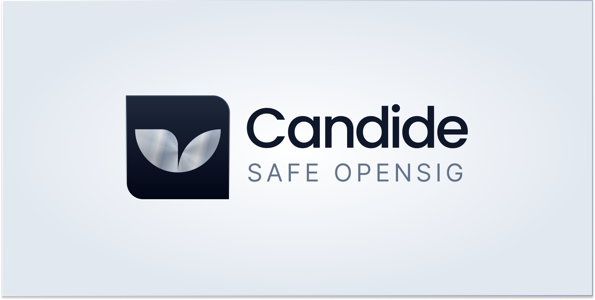

<p align="center">
  
</p>

<h3 align="center">The Final World for Multisig Signing</h3>

<p align="center">
  <a href="https://candide.dev/opensig">Website</a> ·
  <a href="https://ethresear.ch/t/trust-minimized-transaction-simulation-using-state-proofs/23857">Research</a>
</p>

---

## What is Safe OpenSig?

Safe OpenSig is a mobile app for Safe multisig signers. It eliminates blind signing by showing you exactly what a transaction will do before you sign it on your hardware wallet.

**The problem**: When signing Safe transactions, you're often trusting a web interface to show you the truth. But browser extensions, phishing sites, or compromised frontends can manipulate what you see.

**The solution**: Safe OpenSig reconstructs the transaction locally on your device, simulates it, and shows you the real outcome: balance changes, permission changes, everything. Then you verify that what you're signing on your Ledger matches what you just verified.

## Features

- **Transaction Simulation**: See exactly what will happen before signing: token transfers, balance changes, and permission modifications
- **Ledger Hardware Wallet Support**: Visual preview of what your Ledger Nano S/S+ will display, so you can verify character-by-character
- **Multi-Chain Support**: Works with Ethereum, Polygon, Optimism, Base, Arbitrum, Gnosis, and 10+ other networks
- **Local Simulation**: Transaction decoding and EVM execution happen entirely on your device, with state fetched from RPC nodes
- **Trust-Minimized Verification**: State is verified using Merkle proofs from multiple independent nodes

## How It Works

1. **Import or paste** your Safe transaction data
2. **Simulate** the transaction locally using an embedded EVM
3. **Review** the decoded results: balance changes, approvals, and state modifications
4. **Verify hashes** match between the simulation and your hardware wallet
5. **Sign with confidence** knowing exactly what you're approving

## Getting Started

### Prerequisites

- [FVM](https://fvm.app/documentation/getting-started) (Flutter Version Management)
- Flutter 3.32.4 (managed by FVM)

### Installation

```bash
# Clone the repository
git clone https://github.com/candidelabs/safe-opensig.git
cd safe-opensig

# Install dependencies
fvm flutter pub get

# Create .env file with RPC endpoints (see .env.example)

# Run the app
fvm flutter run
```

### Environment Setup

Create a `.env` file with RPC node URLs for the networks you want to support. The app uses multiple nodes per network for trust-minimized state verification.

## Architecture

Safe OpenSig operates on a three-pillar verification model:

| Pillar | Description |
|--------|-------------|
| **Local REVM Simulation** | Runs a Rust EVM directly on-device to decode transaction logic and preview state changes |
| **Cryptographic Verification** | Validates blockchain state using Merkle Patricia Trie proofs (`eth_getProof`) from multiple independent nodes |
| **Hardware Emulation** | Provides a 1:1 preview of Ledger screens for character-by-character verification before signing |

For technical details on the trust-minimized verification approach, see our [research post on ethresear.ch](https://ethresear.ch/t/trust-minimized-transaction-simulation-using-state-proofs/23857).

## Tech Stack

- **Framework**: Flutter 3.32.4 (cross-platform mobile)
- **State Management**: Riverpod
- **Storage**: Hive (local-first, no cloud sync)
- **EVM**: REVM via Rust FFI
- **Navigation**: GoRouter

## Project Structure

```
lib/
├── core/                            # Core infrastructure
│   ├── router/                      # Navigation and routing
│   ├── storage/                     # Local persistence
│   └── theme/                       # App theming
├── features/                        # Feature modules
│   ├── account_management/          # Safe account operations
│   ├── onboarding/                  # First-run experience
│   └── verify_safe_transaction/     # Transaction verification flow
├── shared/                          # Shared utilities
│   ├── models/                      # Domain models
│   ├── widgets/                     # Reusable UI components
│   └── services/                    # Business logic
└── main.dart
```

## Contributing

We welcome contributions! Please follow these guidelines:

### Development Workflow

1. Fork the repository
2. Create a feature branch from `develop`: `git checkout -b feature/your-feature`
3. Make your changes
4. Run `fvm dart format .` and `fvm flutter analyze`
5. Submit a pull request to `develop`

### Branching Strategy

| Branch | Purpose |
|--------|---------|
| `main` | Production releases |
| `develop` | Integration branch for PRs |
| `feature/*` | New features |
| `fix/*` | Bug fixes |
| `hotfix/*` | Critical production fixes |

## Security

Safe OpenSig is designed with security as the primary concern:

- **Minimal network requests**: Only connects to RPC nodes for state verification
- **No external dependencies** for transaction decoding
- **Open source** for full auditability

If you discover a security vulnerability, please report it responsibly.

## Links

- [Website](https://candide.dev/opensig)
- [Trust-Minimized Verification Research](https://ethresear.ch/t/trust-minimized-transaction-simulation-using-state-proofs/23857)
